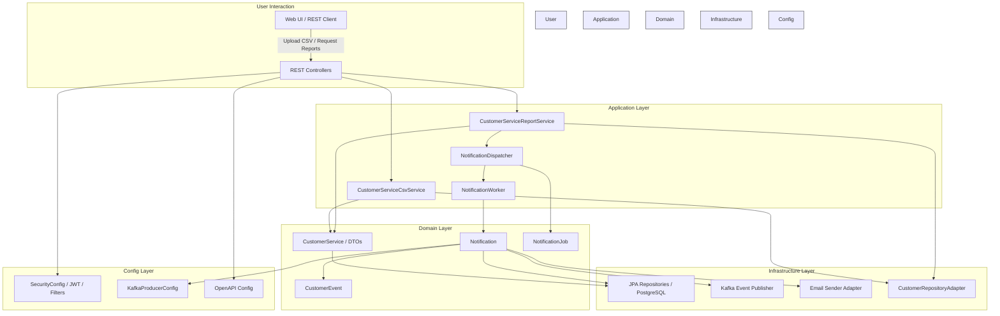

# Spring Boot Customer Analysis Application

This is a Spring Boot application for customers analysis, integrated with PostgreSQL, Kafka, and Zookeeper. A MailHog container is present to simulate mail sending. 
The application exposes REST APIs secured with JWT authentication and provides a Swagger UI for interactive API exploration.

---

## Table of Contents

- Functional Overview
- Architectural Overview
- Getting Started
- Running the Application
- Swagger UI & Authentication
- API Endpoints
    - Authentication
    - Customer Management
- Preconfigured Data
- Notes

---

## Functional Overview

The main functionalities of the system include:

- CSV Data Import and Validation

  - Each CSV row represents a customer service with fields: customer_id, service_type, activation_date, expiration_date, amount, and status.
  - The system validates each field, logs non-compliant rows, and continues processing the remaining data.

- Reporting and Analytics

  - Aggregated reports are exposed via RESTful JSON APIs (e.g., /report/summary).
  - Reports include:

   - Total active services per service type.
   - Average spending per customer.
   - Customers with multiple expired services.
   - Customers with services expiring within the next 15 days.

- Asynchronous Notifications

  - Special conditions trigger notifications handled asynchronously:

   - Customers with more than 5 expired services generate Kafka events (alerts.customer_expired) for external consumption.
   - Active services older than 3 years trigger marketing emails for upselling opportunities.

  - Notification handling uses retry policies and proper error logging to ensure reliability.

---

## Architectural Overview

The project is implemented using Java 21 and Spring Boot 3.4.10, following a layered and modular architecture:



#### Application Layer

Handles business logic, service orchestration, and notification dispatching (CustomerServiceCsvService, CustomerServiceReportService, NotificationDispatcher).

#### Domain Layer

Contains core models, DTOs, repositories interfaces, events, and job definitions (CustomerService, Notification, CustomerEvent, NotificationJob).

#### Infrastructure Layer

Implements integration with external systems:

- Persistence: JPA-based repositories for PostgreSQL.

- Messaging: 

  - Kafka event publishing and asynchronous notification handling.
  - Email: SMTP mail sending via Spring Boot Mail.

- REST API: Controllers expose endpoints, with exception handling and JWT-based security.

#### Configuration Layer

Configurations for Kafka, OpenAPI documentation, and Spring Security (JWT authentication, filters, roles, and user management).

#### Testing

Unit and integration tests leverage JUnit, Spring Boot Test, Testcontainers (PostgreSQL, Kafka), and Spring Security test support.

### Technology Stack

- Backend: Java 21, Spring Boot 3.4.0, Spring Data JPA
- Messaging: Apache Kafka 7.5.0
- Database: PostgreSQL 18.0 with Flyway migrations
- Security: Spring Security with JWT authentication
- Email: Spring Boot Mail
- File Processing: Apache POI for CSV parsing
- Documentation: OpenAPI / Swagger
- Testing: JUnit, Testcontainers, Spring Boot Test
- Test API: Postman 

### Deployment

The application is containerized and can be deployed with Docker Compose, including services for PostgreSQL, Kafka (with Zookeeper), Mailhog (for email testing), and the customer-analysis service itself.

---

## Getting Started

### Prerequisites

- Docker
- Docker Compose

Clone this repository and navigate to the project root:

```bash
git clone <repository-url>
cd ROOT_PROJECT
```

---

## Running the Application

Start the application using Docker Compose:

```bash
docker-compose up --build
```

This will start:

- PostgreSQL (port 5432) with database customerdb
- Zookeeper (port 2181)
- Kafka (port 9092)
- Spring Boot Application (port 8080)
- MailHog (port 1025 for STMP, 8025 for user interface)

Logs are persisted in the local logs/ folder.
Data are persisted in the local postgres_data/ folder.

To stop the application:

```bash
docker-compose down
```

---

## Swagger UI & Authentication

Access the Swagger UI at:  
http://localhost:8080/swagger-ui/index.html

### Authenticating on Swagger

1. Click the Authorize button on Swagger UI
2. Enter a JWT token in the following format:  
   Bearer <JWT_TOKEN>

### How to get a JWT Token

Use the /auth/login endpoint with one of the preconfigured users

Request Example:

```json
{
  "username": "admin",
  "password": "admin123"
}
```

Response Example:

```json
{
  "token": "eyJhbGciOiJIUzI1NiIsInR..."
}
```

Copy the token value and use it in Swagger's Authorize dialog.

---

## API Endpoints

### Authentication (/auth)

- Method: POST
- Endpoint: /auth/login
- Description: Authenticate a user and retrieve a JWT token

---

### Customer Service management (/api/customerservice)

Authorization:
- ADMIN – full access
- OPERATOR – can upload file

1. **Upload new CSV**
- Endpoint: POST /api/customerservice/upload
- Roles: ADMIN, OPERATOR
- Description: Uploads a CSV file containing customer services. The CSV is processed and stored in the database. Any duplicate or invalid rows are ignored and logged.
- Request: Multipart file to upload
- Headers required: 

     - Content-Type: multipart/form-data
     - Authorization: Bearer <token>

- Response Example:  
     - 200 OK: File processed successfully
     - 400 Bad Request: File missing or empty


2. **Generate Customer Service Report**
- Endpoint: GET /api/customerservice/summary
- Roles: ADMIN
- Description: Generates an aggregated Excel report containing the following statistics on customer services:

    1.Total active services grouped by service_type
    2.Average spending per customer (customer_id)
    3.List of customers with more than one expired service (status = EXPIRED)
    4.List of customers with services expiring within the next 15 days

- Headers required:

  - Accept: application/vnd.openxmlformats-officedocument.spreadsheetml.sheet
  - Authorization: Bearer <token>

- Response Example:  

  - 200 OK: Report generated successfully
  - Content-Type: application/vnd.openxmlformats-officedocument.spreadsheetml.sheet
  - Content-Disposition: attachment; filename=customer_report_<timestamp>.xlsx
  - Body: Excel file in .xlsx format

#### Notes: 
in "Documents" folder an exported Postman collection is present to provide test option outside swagger

## Preconfigured Data

### Customer Service

- Database contains 10 sample customers service.
- In "Documents" folder a example_customers.csv is present and can be used to test upload endpoint.

### Users

- Username: admin  
  Password: admin123  
  Role: ADMIN  
  Permissions: full access (upload, generate report)

- Username: operator  
  Password: operator123  
  Role: OPERATOR  
  Permissions: upload

---

